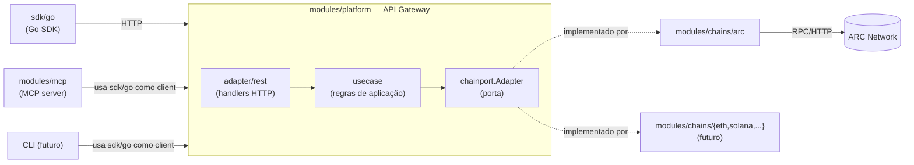

# Arquitetura

Este documento traduz os princípios do [CHARTER.md](../CHARTER.md) em decisões técnicas concretas. Para o histórico de trade-offs e alternativas descartadas, veja [tradeoffs.md](tradeoffs.md).

## Visão geral

## Camadas (Clean Architecture)

Aplicadas dentro de `modules/platform`:

| Camada | Pacote | Responsabilidade | Depende de |
|---|---|---|---|
| Domain/Port | `modules/contracts` | Define `chainport.Adapter` — o contrato blockchain-agnostic | nada (stdlib apenas) |
| Use case | `internal/usecase` | Regras de aplicação (ex: `WalletService`) | `chainport` |
| Adapter (entrada) | `internal/adapter/rest` | Handlers HTTP, tradução request/response | `usecase` |
| Adapter (saída) | `modules/chains/arc` (módulo externo) | Implementação concreta do `chainport.Adapter` para a ARC Network | `chainport` |
| Infra | `internal/infra/config` | Configuração via variáveis de ambiente | nada |
| Composição | `cmd/gateway/main.go` | Wiring manual (constructor injection), é o único lugar que conhece implementações concretas | tudo acima |

Regra de dependência: código em `internal/domain` e `internal/usecase` nunca importa um módulo de chain específico (`modules/chains/*`). Apenas `cmd/gateway/main.go` (a composition root) conhece qual adapter concreto está em uso.

## Por que `contracts` é um módulo Go separado (não `internal/`)

Pacotes `internal/` só podem ser importados de dentro da mesma árvore de módulo. Como cada blockchain é implementada como um **módulo Go independente** (`modules/chains/arc`, e futuramente `modules/chains/ethereum`, etc.), o contrato `chainport.Adapter` precisa estar em um pacote público e compartilhado — daí `modules/contracts` existir como seu próprio módulo, sem depender de `platform` nem de nenhum chain module. Isso mantém a promessa de "Blockchain Agnostic": adicionar uma rede nova nunca exige tocar em `platform` ou em `contracts`, apenas criar um novo módulo que implemente a interface.

## MCP server como cliente da API, não como segunda implementação de negócio

`modules/mcp` **não** reimplementa `usecase.WalletService`. Ele consome a mesma API pública que qualquer outro cliente externo usaria, via `sdk/go`. Isso garante que agentes de IA e desenvolvedores humanos tenham exatamente a mesma superfície de comportamento — sem lógica duplicada nem risco de divergência entre os dois caminhos.

## Monorepo com `go.work`

Todos os módulos (`modules/contracts`, `modules/platform`, `modules/chains/arc`, `modules/mcp`, `sdk/go`) vivem em um único repositório Git, mas são módulos Go independentes, unidos localmente por [`go.work`](../go.work). Isso permite:

- Desenvolvimento e teste integrado sem precisar publicar/versionar cada módulo separadamente durante o dia a dia.
- Versionamento e release independentes por módulo quando o projeto amadurecer (ex: publicar `sdk/go` com sua própria tag semver, sem forçar release do `platform`).
- Adição de novas chains como novos módulos, sem qualquer alteração no módulo `platform`.

## Injeção de dependência

Manual, via construtores (`NewWalletService(adapters)`, `NewWalletHandler(service)`, etc.), sem biblioteca de DI. O único ponto de wiring é `cmd/*/main.go`. Reavaliar apenas se o número de dependências por serviço crescer a ponto de tornar o wiring manual repetitivo demais (ver [tradeoffs.md](tradeoffs.md)).

## Custódia de chaves privadas (`chainport.KeyStore`)

`CreateWallet` gera a chave e a entrega para um `chainport.KeyStore` injetado no `Adapter` — o chamador da API nunca vê a chave privada. A Aureon é **custodial por design**: isso é o que permite `createWallet()` e `transfer()` funcionarem como dois passos independentes (como o charter descreve nas tools MCP), sem o chamador gerenciar chaves. Desde a Sprint 5, o Gateway usa `internal/infra/keystore.Postgres`, que criptografa cada chave com AES-256-GCM antes de gravar — a chave mestra de criptografia vem de `AUREON_KEYSTORE_ENCRYPTION_KEY` (env var), não de um KMS real ainda (ver [TR-010](tradeoffs.md#tr-010-criptografia-em-repouso-com-chave-de-aplicação-aes-256-gcm-em-vez-de-kms)). `keystore.Memory` continua existindo só para testes unitários. Ver [TR-008](tradeoffs.md#tr-008-aureon-é-custodial-guarda-as-chaves-privadas-via-chainportkeystore-começando-com-storage-em-memória).

Assim como `chainport.Adapter`, o `KeyStore` é uma porta genérica (não específica da ARC): a mesma implementação em `platform/internal/infra/keystore` é injetada em qualquer adapter de chain, evitando duplicar lógica de armazenamento de chave por módulo.

## Erros e HTTP status

Nesta fase inicial, qualquer erro vindo do `usecase` é traduzido para `400 Bad Request` pelos handlers REST. Isso é propositalmente simplificado — a Sprint de Auth/erros (ver [implementation-plan.md](implementation-plan.md)) deve introduzir um tipo de erro de aplicação com código semântico (`not_found`, `unsupported_network`, `upstream_unavailable`, ...) mapeado para status HTTP corretos.
